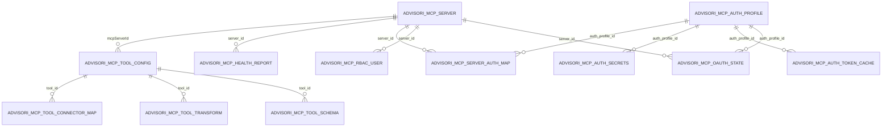

# ERD & Relationen (Advisori MCP)

## Schlüsselbeziehungen (Kurzbeschreibung)
- advisori_mcp_server.id → health_report.server_id, server_auth_map.server_id, rbac_user.server_id, oauth_state.server_id, tool_config.mcpServerId
- advisori_mcp_auth_profile.id → server_auth_map.auth_profile_id, auth_secrets.auth_profile_id, auth_token_cache.auth_profile_id, oauth_state.auth_profile_id
- advisori_mcp_tool_config.id → tool_connector_map.tool_id, tool_transform.tool_id, tool_schema.tool_id

## Kardinalitäten
- Server zu Tools/Health/RBAC/AuthMap: 1 : N
- AuthProfile zu Secrets/TokenCache/OAuthState/AuthMap: 1 : N
- ToolConfig zu ConnectorMap/Transform/Schema: 1 : N

