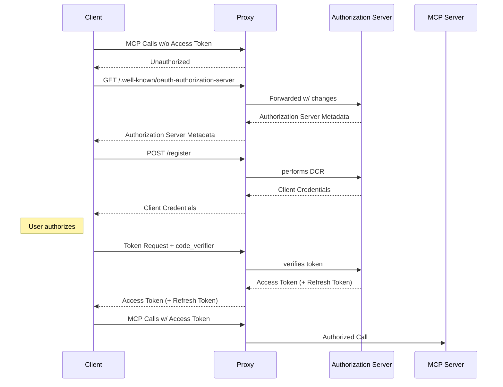
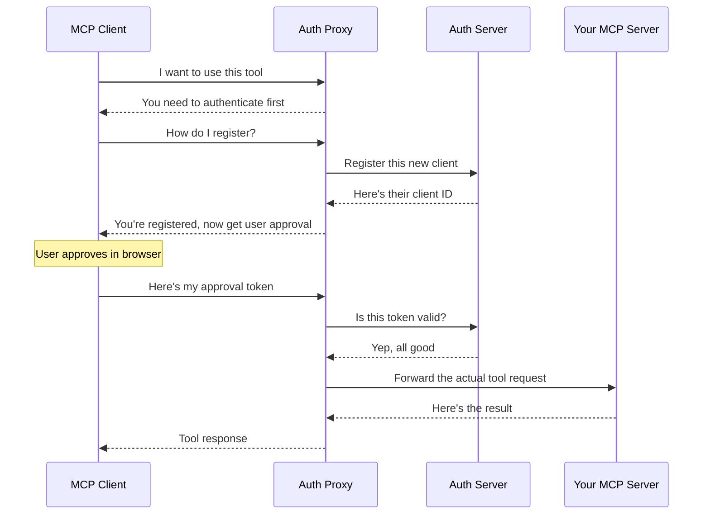

# Securing Your Remote MCP Tools - MCP Authorization Spec

Claude, VS Code, Cursor, and other MCP clients can connect to your tools over HTTP. This means if you deploy an MCP Server somewhere publicly accessible, you can configure MCP Clients to reach it over HTTP.

That's awesome - but *publicly accessible* also means anyone on the internet can hit your endpoints and either steal your data or increase your compute costs.

Let's fix that by adding authentication in accordance with the MCP specification. Here's how to get it working in 5 minutes, then we'll dig into what's actually happening and learn more about this part of the spec.

### Try It Out

For our setup you'll need Keycloak (an identity provider) and the [open-mcp-auth-proxy](https://github.com/wso2/open-mcp-auth-proxy) that handles the MCP-specific OAuth bits.

First, let's get into the right directory where we'll set everything up:

```bash
cd docs/oauth
```

**Step 1: Get the proxy**

Download and set up the authentication proxy ([see releases for other distributions](https://github.com/wso2/open-mcp-auth-proxy/releases/)):

```bash
wget https://github.com/wso2/open-mcp-auth-proxy/releases/download/v1.1.0/openmcpauthproxy_linux-v1.1.0.zip
unzip openmcpauthproxy_linux-v1.1.0.zip
mv ./openmcpauthproxy_linux-v1.1.0/openmcpauthproxy .
rm -rf ./openmcpauthproxy_linux-v1.1.0 openmcpauthproxy_linux-v1.1.0.zip # cleanup
```

**Step 2: Start everything up**

Now let's get all the services running:

```bash
# Start Keycloak (this will wait until keycloak is fully ready)
docker compose -f docker-compose.keycloak.yml up -d

# Wait for keycloak to be ready
until curl -s -f http://localhost:8080/realms/mcp/protocol/openid-connect/certs | jq -e '.keys | length > 0' > /dev/null 2>&1; do
  echo "Waiting for Keycloak JWKS to be ready..."
  sleep 2
done

# Start the auth proxy
./openmcpauthproxy --debug

# Start your MCP server (in another terminal from the root)
ts-node-dev --respawn playground/servers/server-stateful.ts
```

**Step 3: Test it**

Time to see the authentication in action! You have two options:

```bash
# Option 1: Use the MCP Inspector
npx @modelcontextprotocol/inspector@0.14.3

# Option 2: Run MCP client (in another terminal from the root)
ts-node-dev --respawn playground/clients/http-sse-oauth-client.ts
```

Either option will walk you through the OAuth flow in your browser. The MCP client in the terminal then will let you run commands as follows:

```
mcp> call hello-world {"name": "joe"}

🔧 Tool 'hello-world' result:
Hello, joe! Your user agent is: node
```

Cool, right? Your client just authenticated automatically without any manual setup. The diagram below shows how all the pieces fit together:



So the proxy handles:

- Mapping the well-known endpoint `/.well-known/oauth-authorization-server` to the actual endpoint of the Authorization Server
- Implementing specific Dynamic Client Registration for the supported IdPs
- Reverse proxying other traffic to the Authorization Server (such as token verification etc.)

And the MCP Server only concerns itself with tool calls.

## What Just Happened? (And How This Actually Works)

When you ran that test, a bunch of interesting things happened behind the scenes. Let's break it down.

### The Core Problem We Just Solved

You might be saying, "But isn't this what we always do when we authenticate and authorize traffic to services? Put a gateway (or proxy) in front of the services, and let the gateway handle those concerns?"

**Yes, but there's a small twist.**

Most auth systems expect you to know all your clients ahead of time. You register "MyApp v1.2" in your identity provider, get a client ID, and you're good to go.

But with MCP? The clients don't know ahead of time which auth systems the MCP Servers will use for authentication. Each MCP Server can have a different auth server - they can be SaaS offerings, running on premises, and so on.

To illustrate this with an absurd example. Do we expect the people at Claude.ai (or any MCP client for that matter) to go to every IdP server and register their client ahead of time? (That's impossible, but there is a solution!)

The twist: **MCP clients need to authenticate on the fly!**

### How MCP Solves This

The MCP spec uses OAuth with dynamic client registration. Here's what happened when you ran the test:

1. **Client shows up:** "Hi, I'm client X, I'd like to use this tool"
2. **Your auth server:** "OK, you're now registered as client #12345"
3. **User gets asked:** "This client wants to access YourTool, is that cool?"
4. **User approves:** "Yeah, that's fine"
5. **Client gets token:** Now the client can call your tool on behalf of that user

Thus clients don't have to be registered ahead of time and everything happens automatically.



This means the auth proxy sits in front of your MCP server and handles all the authentication dance. Your server just sees authenticated requests coming through.

### The Players in This Setup

**Keycloak (Authorization Server):** This is what actually authenticates users and issues tokens. It's like the DMV - it knows who people are and can issue credentials.

**Auth Proxy:** This translates between MCP clients and Keycloak. It handles the dynamic registration part (which most identity providers don't support out of the box) and forwards authenticated requests to your MCP server.

**Your MCP Server (Resource Server):** This is your actual tool. It doesn't care about OAuth - it just responds to requests that the proxy forwards to it.

**MCP Client:** Claude, VS Code, or whatever is trying to use your tool on behalf of a user.

### What Changed in the Latest MCP Spec

The newer MCP spec (2025-06-18) allows the MCP server to tell clients "hey, don't talk to me about auth, talk to that other server over there."

This means even cleaner separation. Your MCP server becomes purely about business logic. All the OAuth complexity lives elsewhere.

In practice, you still need something to handle the dynamic client registration (since most identity providers have their own unique implementation not supported by all proxies).

Using @rekog/mcp-nest, you don't have to do anything special to use the latest spec. You can just configure the Protected Resource Metadata well-known endpoint (which is what tells the clients how to interact with the resource server and where they find the authorization server) as shown below:

```typescript
@Controller('.well-known')
class WellKnownController {
  @Get('oauth-protected-resource')
  getOAuthProtectedResource() {
    return {
      resource: 'http://localhost:3030',
      authorization_servers: ['http://localhost:9090'],
      jwks_uri:
        'http://localhost:8080/realms/mcp/protocol/openid-connect/certs',
      bearer_methods_supported: ['header', 'body', 'query'],
      scopes_supported: ['profile', 'offline_access'],
      resource_documentation: 'http://localhost:3030/docs',
      resource_policy_uri: 'http://localhost:3030/policy',
      resource_tos_uri: 'http://localhost:3030/tos',
    };
  }
}
```

And register it with Nest:

```typescript
@Module({
  imports: [
    McpModule.forRoot({
      name: 'playground-mcp-server',
      version: '0.0.1',
      streamableHttp: {
        enableJsonResponse: false,
        sessionIdGenerator: () => randomUUID(),
        statelessMode: false,
      },
    }),
  ],
  controllers: [WellKnownController],  // Registering it
  providers: [GreetingResource, GreetingTool, GreetingPrompt],
})
```

You can drop this in the file `playground/servers/server-stateful.ts` and try it out.

The beauty is that once this is set up, it just works. New MCP clients can connect automatically, users control access through familiar OAuth consent screens, and your server stays focused on what it does best.
